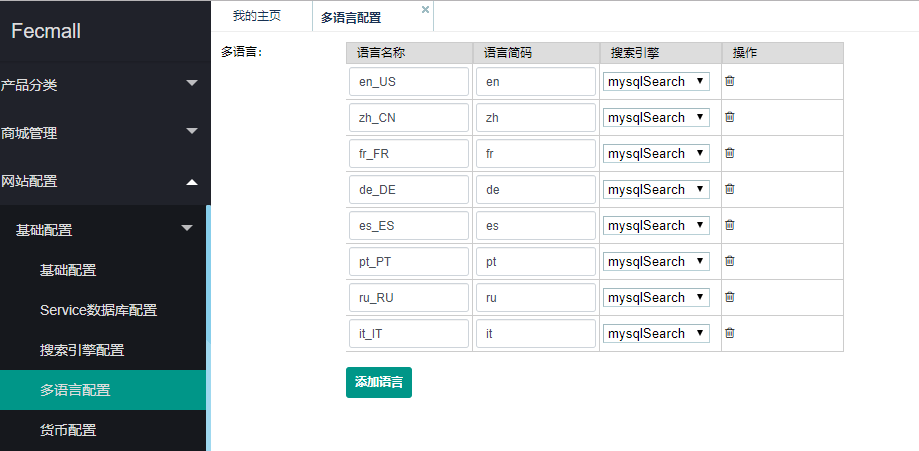
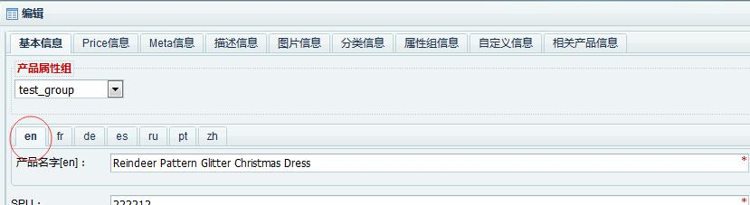
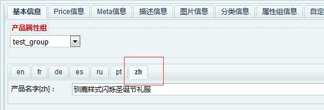

Fecmall 多语言
================

> fecmall 支持多语言翻译，可以通过多个途径进行语言的切换，一共分为四个大部分：
> 数据库数据的翻译，网页内容数据的翻译，网站提示和报错等信息的翻译，邮件内容的
> 语言翻译，当您为一个store指定了语言，那么就会按照上面四种途径进行相应的语言翻译，
> ,进而形成对应语言的翻译语言。


> fecmall是支持多store的，store一般是用来构建多语言站点，
> 可以为每一个store指定不同的语言和url结构，设置不同的语言，默认货币,模板等。


本文档是从原理角度讲述fecmall多语言，如果您想配置多语言（fecmall-2.13.0+版本），可以参看：[Fecmall 添加多语言](fecmall_add_lang.md)

## 后台配置多语言




上面是fecmall默认的几个语言配置，您可以根据自己的业务需求进行语言的设置和添加。

fecmall的每个store设置的不同语言，以及对应的产品搜索(mongodb full search需要根据语言进行切词)，都要依赖上面的配置。


[语言简码表](http://blog.csdn.net/wed110/article/details/50886195)

通过上面，配置了fecmall商城里面可用的各个语言配置，各个store可以切换的语言就是从上面的配置数组中获取。


### 配置各个入口的i18n组件（yii2的i18n组件的配置）

> fecshop的翻译，是基于yii2的i18n组件(component)，因此，我们需要对其进行配置，
下面的配置是在各个入口的配置文件中进行的，因此，您可以让你的各个入口的i18n组件进行不同的配置，
一般都是相同的配置，下面是详细的说明

打开@app/config/fecshop_local.php(@app是各个入口的统称，可以以@appfront为例子)

找到下面的配置

```
// 组件
$components = [
    'i18n' => [
        'translations' => [
            'appfront' => [
                'basePaths' => [
                    '@appfront/languages',
                ],
                // base language code
                'sourceLanguage' => 'en_US',
                /**
                 * @var bool whether to force message translation when the source and target languages are the same.
                 * Defaults to false, meaning translation is only performed when source and target languages are different.
                 * see: @yii/i18n/MessageSource.php  @property $forceTranslation
                 */
                'forceTranslation' => true,
            ],
        ],
    ],
];
```

`basePaths`: 配置各个入口本地翻译文件所在的路径，默认为 '@appfront/languages'

`sourceLanguage`： 当前入口的基础语言，默认语言

`forceTranslation`：是否强制翻译，当入口store的`当前语言`== `sourceLanguage`（上面配置的选项），是否强制翻译,
fecmall默认配置了`true`，譬如： 上面设置了 `en_US`, 如果store的当前语言也是 `en_US`， 那么，
`forceTranslation`设置为`true`后， 会去 @appfront/languages/en-US/appfront.php 文件
去找相应的翻译内容，因此对于fecshop的默认英文语句，如果你想更改，
可以通过翻译的访问（开启forceTranslation）

如果你想做中文商城，你仍然可以让基础语言设置en-US，然后中文使用翻译的方式进行，
在文档的末尾处有说明。

### 二：翻译


> 对于内容部分的翻译，分为4部分：网页文字内容的多语言，数据库数据的多语言，邮件内容的多语言翻译，
错误信息提示信息等内容的多语言翻译，下面是详细说明

### 数据库数据

数据库中的数据，譬如产品表中的产品名字，产品描述等，分类表中的分类名字和分类描述，
在数据库表中都是保存了多份语言数据

> 下面图片中显示的各个语言的选项，就是上面第一部分`配置语言项`配置数组的各个语言，在
`配置语言项`配置数组中添加其他语言后，下面就会显示添加的语言，您可以编辑保存该语言的内容





在网站前台展示数据的时候，根据当前的store设置的语言，将相应语言的数据取出来展示即可。
如果相应语言的值在数据库中没有添加，那么将会把默认语言的值取出来作为当前语言的值。

### 网页内容语言的翻译

网站内容语言的翻译，是依靠的翻译文件，在实现方面依赖的`Yii::t()`函数，关于
Yii2多语言翻译的知识，可以参看地址 [Yii2多语言](http://www.yiichina.com/doc/guide/2.0/tutorial-i18n)

对于fecmall的翻译，是基于yii2的`Yii::t()`函数实现，也就是page translate services类，
使用方式如下：

```
Yii::$service->page->translate->__('Product Review');
```

详细的代码您可以去这个services参考详细代码，总体来说，该函数，在翻译文件（下一部分说的翻译文件）
中查找`Product Review`字符串是否在相应语言中存在翻译，如果存在，则使用翻译后的字符串。

对于存在变量的翻译,可以使用下面的方式：

```
$review_count = 5;
Yii::$service->page->translate->__('based on {review_count} Customer Reviews',['review_count' => $review_count])
```

在翻译文件中添加翻译：

```
'based on {review_count} Customer Reviews' => '基于{review_count}条用户评论',
```

即可。

另外，fecmall可能有一些地方存在翻译疏漏，您可以自己找到相应的字符串位置，
修改一下，通过上面的函数返回，然后在翻译文件中添加相应的翻译即可。


### 邮件内容的翻译

邮件内容的模板，是在theme中，譬如appfront的邮件模板，是在
`@fecshop/app/appfront/theme/base/default/mailer`下面,其中,
`@fecshop/app/appfront/theme`是模板文件夹路径，`base`是模板包名，
`default`是模板名，`mailer`是邮件theme文件夹，在mailer路径下，打开
`customer/account/forgotpassword`,里面是用户忘记密码发送的邮件，
其中s`ubject_`开头的都是邮件的标题，`body_`开头的都是邮件的内容
`en`结尾的代表英文语言的邮件，`zh`结尾的代表中文语言的邮件，打开相应文件
从`en`复制一份到对应的语言，然后修改里面的语言即可，
有一些语言，里面没有对应的文件，您新建即可。

添加或者修改邮件内容，举例：

如果您想修改 `@fecshop/app/appfront/theme/base/default/mailer/customer/account/forgotpassword/body_zh.php`,
里面的内容，你可以在 `@appfront/theme/terry/theme01/里面新建文件 mailer/customer/account/forgotpassword/body_zh.php`（如果存在，则不需要创建）
然后将上面的文件内容复制到新建的文件中，进行修改即可，这样就完成了邮件内容的添加或者重写。


通过以上四种方式的翻译，我们就完成了整个fecmall多语言翻译的闭环。

**注意：** 如果您不添加翻译，则默认就会使用英语的翻译。

关于邮件更详细的介绍，可以参看：[Fecmall 邮件](fecmall_email.php)


### 提示报错信息的翻译

在网站顶部，会出现一些提示信息和报错信息，譬如您注册邮箱的时候，会提示你的格式不正确等，
这些数据也是用翻译文件的方式，方法上上面类似，都是在一个同一个文件中
添加翻译内容,方法和方式同上。


### Fecmall的翻译文件路径为：（举例appfront入口）

`@vendor/fancyecommerce/fecshop/app/appfront/languages/`，在这个文件夹下面可以看到
各个语言的文件包，进入相应语言，就可以看到翻译文件，譬如中文的翻译文件路径为
：`@vendor/fancyecommerce/fecshop/app/appfront/languages/zh_CN/appfront.php`
，在这个文件里面就可以看到所有的中文翻译内容，如果您想重写或者添加新
的翻译，可以到 `@appfront/languages/zh_CN/appfront.php` 中添加或者重写翻译
数组，注意，这里使用的是php的数组，需要按照相应格式填写，否则会报错。

在翻译文件中，您可能看到这样的带有**{}**的部分，譬如下面的 `{passwdMinLength}`,
这是一个动态变量，这个请不要翻译和做其他的任何改动，直接复制上去即可，譬如下面的
翻译，这个值是由php动态计算而来。

```
 'Password length must be greater than or equal to {passwdMinLength}'
								=> '密码长度必须大于或等于{passwdMinLength}',
 'Password length must be less than or equal to {passwdMaxLength}'
								=> '密码长度必须小于或等于{passwdMaxLength}',
 'The passwords are inconsistent'
								=> '密码不一致',
```


### 三：各个入口的语言配置


> 当我们在上面的步骤中设置了语言，以及各个语言对应的翻译文件后，
> 我们需要为各个入口设置对应的默认语言


### 设置各个域名下面的默认语言

在后台store设置中设置，详细参看：[Fecmall Store](fecmall_store.md)


### 四：如何添加一门新语言

在后台store设置中设置，详细参看：[Fecmall Store](http://www.fecmall.com/topic/2230)


### 五：如何只保留中文语言，去掉其他的语言

在后台设置

### 六：后台如何添加多语言


在后台store设置中设置，详细参看：[Fecmall Store](fecmall_store.md)

### 七：其他参考


http://www.fecshop.com/topic/1431

