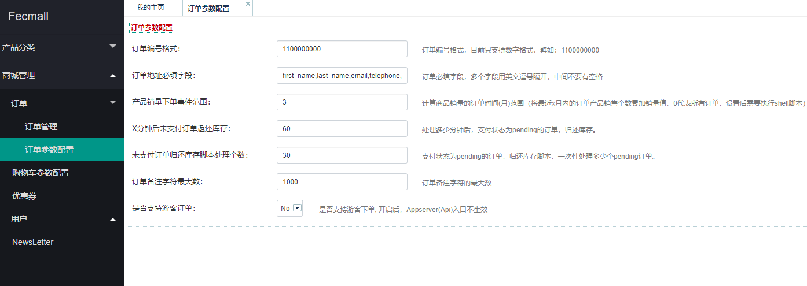

Fecmall 订单
=============

> fecmall 订单指的是在fecmall下单后的订单信息。


### fecmall后台订单参数配置





### 订单配置

#### 订单状态配置（使用默认即可）

为：`@common/config/fecshop_local_services/Order.php`，详细如下：

```
<?php
/**
 * FecShop file.
 *
 * @link http://www.fecshop.com/
 *
 * @copyright Copyright (c) 2016 FecShop Software LLC
 * @license http://www.fecshop.com/license/
 */
return [
    'order' => [
        // !!!!!!下面是订单支付状态!!!!!!! ,各个订单状态查看相应注释
        // 等待付款状态
        'payment_status_pending'            => 'payment_pending',
        // 付款处理中，(支付处理中，因为信用卡有预售，因此需要等IPN消息来确认是否支付成功)
        'payment_status_processing'         => 'payment_processing',
        // 收款成功（支付状态已确认，代表已经收到钱了）
        'payment_status_confirmed'          => 'payment_confirmed',
        // 欺诈【当paypal的返回金额和网站金额不一致【以及货币类型】的情况，就会判定该状态】
        'payment_status_suspected_fraud'    => 'payment_suspected_fraud',
        // 订单支付已取消【用户进入paypal点击取消订单返回网站，或者payment_pending订单超过xx时间未支付被脚本取消，或者客服后台取消】
        'payment_status_canceled'            => 'payment_canceled',
        // 订单审核中（订单收款成功后，进入erp，需要客服审核，才能开始发货流程，或者可能存在某些问题，被客服暂时挂起）
        'status_holded'                     => 'holded',
        // 订单备货处理中，从成功收款进入erp并客服审核成功后，进入备货流程 到 发货前的状态
        'status_processing'                 => 'processing',
        // 订单已发货【订单包裹被物流公司收取后】
        'status_dispatched'                 => 'dispatched',
        // 订单已退款【已收款订单因为某些原因进行退款，譬如：仓库无货，用户收到货后发现破损退款等】
        'status_refunded'                   => 'refunded',
        // 订单已完成，【用户收到货物xx时间后，未发起纠纷争端，订单状态标记为已完成】
        'status_complete'                   => 'completed',
    ],    
];

```

### 订单状态的大致流程：

1.生成订单后，订单等待支付，订单的状态为 `payment_status_pending`（等待付款状态）

2当跳转到第三方支付，譬如paypal，如果用户没有使用paypal的余额，而是使用了paypal
绑定的信用卡支付，支付完成后跳转到网站，订单的状态为`payment_status_processing`（付款处理中），
原因是paypal需要到信用卡发卡行扣款，在扣款没有完成之前，在paypal的后台可以查看这个订单，
但是，并未收到款，需要等待paypal去信用卡扣款成功，
当paypal扣款成功后，会以IPN消息的方式，给fecshop的ipn接收API发送一个post请求，告诉fecshop订单支付已收款，
然后fecshop会把订单状态改成`payment_status_confirmed`（收款成功）

3.如果用户使用的是paypal余额付款，那么付款直接成功，订单状态将直接被改为`payment_status_confirmed`（收款成功）

4.当paypal返回的订单信息和网站订单金额和货币类型不一致，就会被fecshop判定为欺诈订单，
订单类型更改为： `payment_status_suspected_fraud` （欺诈）

5.如果用户跳转到paypal网站支付，如果用户没有支付，而是点击了取消链接，那么就会跳转回fecshop，订单将会被
取消，释放库存，订单状态更改为 `payment_status_canceled` (订单支付已取消) 

6.`payment_status_pending`（等待付款状态）的订单，有一些用户跳转到支付平台后，
然后就关掉了页面，那么这个订单就会一直处于等待付款状态，占用库存，因此，我们需要后台脚本，
将一段时间内没有支付的`payment_status_pending`订单取消掉，
订单状态更改为 `payment_status_canceled` 并释放库存。

7.已付款订单的处理，一般都是在erp系统中处理，
因此通过脚本将订单推动到erp，推送成功后订单状态变成`status_holded`(订单审核中)

8.erp客服审核订单，审核成功后，进入备货流程，订单状态改成`status_processing`（订单备货处理中）

9.备货完成，订单发货，   订单状态改成 `status_dispatched`（订单已发货）

10.订单发货，买家收到货物后，发现有问题或者其他原因要求退货，商家允许，达成一致后，
订单状态改成 `status_refunded` 订单已退款，

11.如果买家没有纠纷，那么过一段时间后，订单状态为 `status_complete` (订单已完成)

> 对于erp处理过程中会有很多的状态，可以做一个关系对应表，把这些状态做一下关系对应。

### 其他配置说明

`increment_id` ：为订单编号格式

`requiredAddressAttr`： 为下单界面必填的字段

`minuteBeforeThatReturnPendingStock`： 这个是下面的后台脚本
（释放未付款订单库存的脚本）所用到的参数，将pending（未支付的订单）
的库存释放掉，这里的单位是分钟，如果您的库存为零库存（
零库存指的是，如果没有库存
可以通过采购部门采购，相当于您不需要考虑库存），可以不需要跑这个脚本。

`orderCountThatReturnPendingStock`： 这个后台脚本一次性处理多少个pending订单。

> **注意**：通过脚本将pending的库存返还给产品后，订单的状态将会变成取消状态，
> 订单取消状态，是无法进行支付的，因此，`minuteBeforeThatReturnPendingStock`
> 尽量设置的大一些，我设置的默认为10个小时，对于零库存商城
> （也就是产品库存为0没有关系，可以继续卖，然后采购部门去采购，这属于零库存模式），
> 这种模式可以批量将产品的所有库存设置的非常大，下面的这个脚本也不需要跑。
> ，下面的这个脚本就是根据上面设置的参数来处理pending状态订单，释放产品库存的脚本。


### 释放未付款订单库存的脚本

详细参看：[order:pending订单取消脚本](http://www.fecshop.com/doc/fecshop-guide/develop/cn-2.0/guide-fecmall-console-pending-cancel.html)

### 订单支付状态的进一步验证

如果您感觉还是不放心，订单传递到erp进行发货处理的时候，加入一层付款成功验证，
譬如paypal，您可以去官方网站下载付款成功的订单，也就是csv表格
，然后通过导入的方式，二次验证订单支付状态，这样是最稳妥的方式，
另外还需要验证一下货币和金额。


### 下单后购物车的清空：

游客用户下单后，购物车是不清空的，支付成功后返回网站再清空购物车产品

登录用户下单后，购物车直接清空，用户可以在账户中心的我的订单中查看未支付订单，重新下单。


