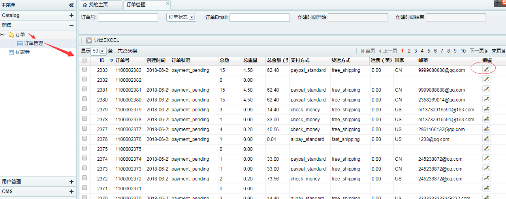
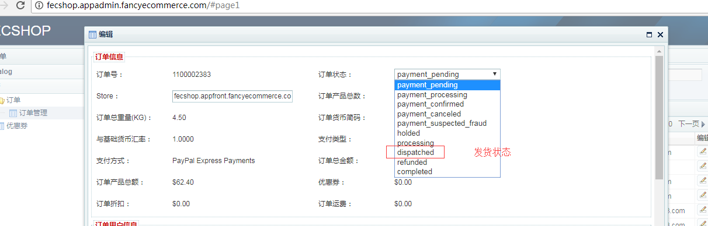
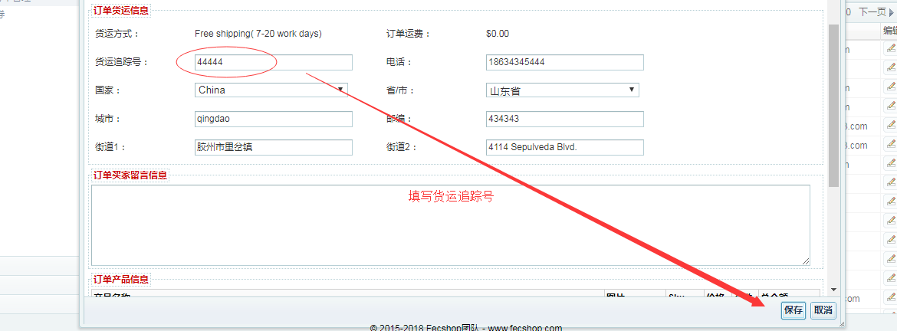

Fecmall 订单货运物流追踪号
======================

> 物流，快递还是其他的一些货运方式，大多数都有追踪号，
当发货后，可以在fecmall的后台填写追踪号

当然，公司如果有能力开发，最好还是用api的方式，
通过erp对接fecshop对接，可以通过fecshop的appapi入口二次开发api

下面是在后台手工填写订单的货运追踪号的方式：

1.后台填写

进入后台，如图，更新订单状态为发货状态，然后填写货运追踪号，保存即可

单少可以这样搞，如果订单多，建议用erp通过api的方式更改订单状态。

