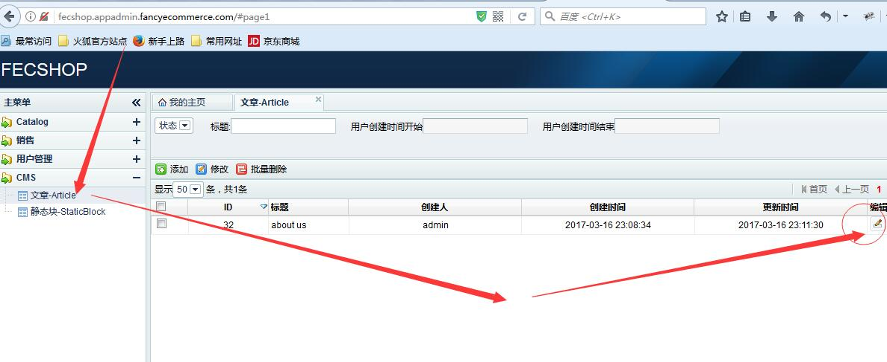

Fecmall page页（文章）
=============

> fecmall page,指的是一些单页面，一般用来写文字条款，譬如
> `http://fecshop.appfront.fancyecommerce.com/index.php/about-us`

您可以在后台编辑

弹出编辑框

然后保存，保存后，查看生成的url key就是url key，当然您也可以自定义url key。
用url key放到域名后面就可以访问了，譬如我新建的关于我们的 url key为 about-us，
那么我访问 http://fecshop.appfront.fancyecommerce.com/index.php/about-us
即可访问我新建的page页。

通过page，可以快速的新建一些文字页面。