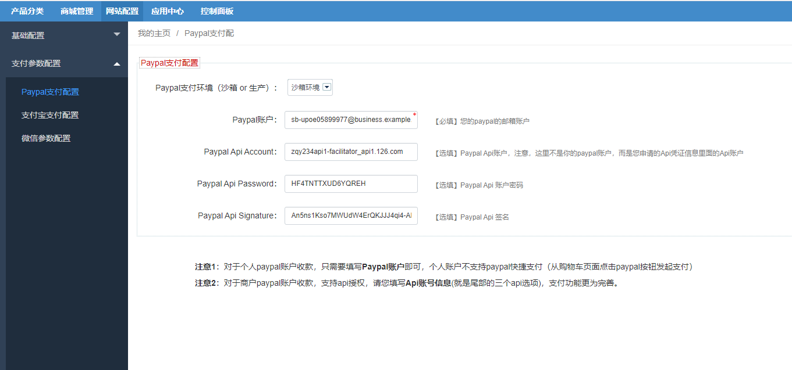

Fecmall Paypal支付
===========

> 对paypal支付的讲解

### 关于paypal支付

**自fecmall-2.14.0版本之后，paypal支持个人账户收款**

您可以在fecmall后台设置paypal账户信息

### 个人paypal账户收款配置

对于个人paypal账户，不支持api，因此，不支持在购物车页面发起的paypal快捷支付方式。

1.需要如上图配置中，填写`paypal账户`进行保存即可，`Paypal Api Account`等api输入框不需要填写。

2.后台菜单：`网站配置` --> `appfront配置` -->  `支付配置` , 进行参数设置：

Paypal标准支付方式：`Enable`

Paypal快捷支付方式：`Disable`

保存即可

3.后台菜单：`网站配置` --> `apphtml5配置` -->  `支付配置` , 进行参数设置：

Paypal标准支付方式：`Enable`

Paypal快捷支付方式：`Disable`

保存即可

### 商户paypal账户收款配置

对于商户paypal账户，支持api，因此商户paypal支持的更为全面

1.需要如上图配置中，填写`paypal账户`，`Paypal Api Account`，`Paypal Api Password`，`Paypal Api Signature`
等进行保存，如果获取请参看资料：

[Fecmall 支付](fecmall_payment_method.md)

[paypal 正式线上收款账户设置](https://www.fecmall.com/topic/297)

2.后台菜单：`网站配置` --> `appfront配置` -->  `支付配置` , 进行参数设置：

Paypal标准支付方式：`Enable`

Paypal快捷支付方式：`Enable`

保存即可

3.后台菜单：`网站配置` --> `apphtml5配置` -->  `支付配置` , 进行参数设置：

Paypal标准支付方式：`Enable`

Paypal快捷支付方式：`Enable`

保存即可

