Fecmall 微信支付
==============

> 对支付平台的配置信息。

### fecmall后台设置微信支付

微信分为：

`pc扫码支付`： 用于pc浏览器进行扫码支付的方式

`jsApi支付`：用于手机微信内部打开网址，进行支付的访问

`手机浏览器html5支付`：用于手机web浏览器打开网址，进行支付的访问


Fecshop-1.x
-------------


### Fecshop 微信支付测试地址

目前支持的微信支付方式

1.Pc电脑浏览器：`微信pc端扫码支付`, 支持入口：appfront（pc端）

2.手机浏览器：`微信h5支付`（在手机浏览器中使用），支持入口：apphtml5，vue（手机web端）

3.微信公众号商城：`微信公众号JsApi支付`（只能微信内部使用），支持入口：apphtml5，vue（手机web端）

您可以在下面点击测试产品进行测试微信支付。

pc测试产品： http://fecshop.appfront.fancyecommerce.com/weixin-test

html5测试产品: http://fecshop.apphtml5.fancyecommerce.com/weixin-test

vue 测试产品： http://demo.fancyecommerce.com/#/catalog/product/5d085e05bfb7ae1fd34b94d2


**注意** ：

1.pc入口是微信扫码支付，可以使用电脑浏览器进行支付，pc端无法使用`微信公众号JsApi支付`和 `微信h5支付`

2.html5和vue手机入口

2.1`微信JsApi支付`，需要在手机微信中打开网址，然后才能进行微信支付，手机浏览器无法
进行支付,支付步骤截图可以参看：http://www.fecshop.com/topic/1938
，这是微信针对公众号商城的支付方式，封闭在微信内部使用

2.2 `微信h5支付`，该支付方式是在手机浏览器中进行的支付，进行下单支付，跳转到微信进行支付，然后跳转回
商城完成支付的一种方式。

把产品加入购物车后，可以看到支付方式

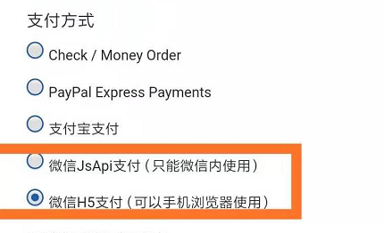


### 微信支付开通

微信支付开通，需要微信`服务号`，注意是`服务号`，而不是`订阅号`，订阅号无法开通微信支付，
而且微信比较`坑B`, 订阅号无法升级为服务号，需要另外注册服务号(认证账户需要花300元)

微信服务号开通地址：https://mp.weixin.qq.com/  ， 点击立即注册,页面刷新后，点击服务号进行注册


微信服务号开通比较繁琐，微信官方需要您的公司执照，公司银行账户打款验证等一系列的操作，才能注册服务号。

注册完服务号后，需要开通微信支付，如图：


申请开通需要提交一些资料，进行银行账户打款，打款后，微信官方会对金额进行核实，没问题后，就可以开通微信支付

开通成功后，您就可以使用了


**这里吐槽一下微信支付：**

1.没有沙盒环境，导致我一直无法做微信支付

2.开通微信支付，必须进行公司认证，还需要开通公司银行账户，然后通过银行账户打款验证，
各种验证一路繁琐，对于正式生产的商家，你可以这样验证，
我仅仅想开发个微信支付，也得这样

3.垃圾的开发体验，无法api获取code值，需要通过页面跳转的方式获取，
对vue等特别的不友好，
这些可能都是为了做微信内封闭，开发微信过程中很多槽点

总之:微信这家公司，是反互联网的，一直做封闭，而不是开放（腾讯所谓的开放，就是先把你封闭到自己的地盘），
这也是最不喜欢的一家公司，反之，阿里巴巴的api，就比较舒服一些。

但是没办法，还是得去做，本来2017年就想做微信支付，一直拖到现在，
今年注册了个公司，开通银行账户，才获取资质开发。


### 微信支付后台设置

> 您需要在微信里面设置域名和回调安全地址

1.服务号：接口权限，网页授权

登陆您的服务号，如图进行操作

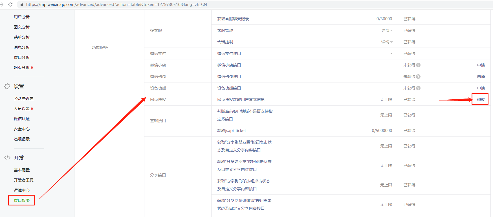

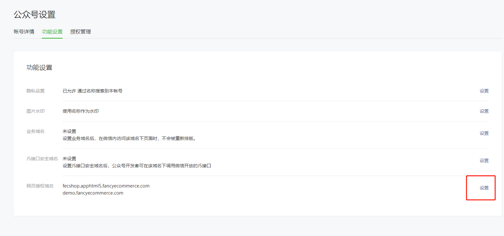

进行设置：

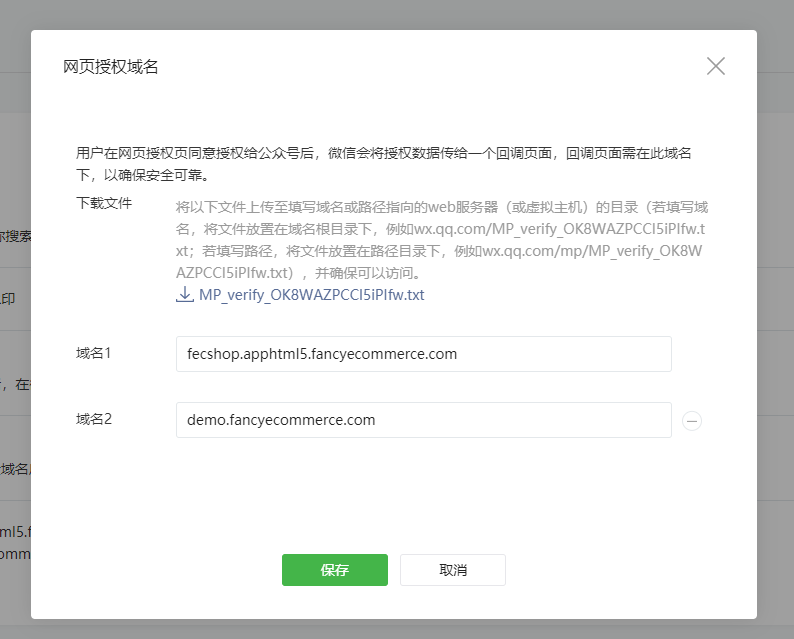

需要注意的是，您需要下载文件：MP_verify_OK8WAZPCCI5iPIfw.txt， 然后将文件上传到到您的web根目录

譬如上面填写的是html5和vue的两个域名， fecshop.apphtml5.fancyecommerce.com对应的是@apphtml5/web/下面

demo.fancyecommerce.com是vue部分，那么我将文件传到vue对应的`dist`目录即可

上传完成后，进行保存，如果文件不上传无法保存成功。


2.商户平台产品中心设置

登陆网址：https://pay.weixin.qq.com/index.php/core/home/login

登陆后，点击产品中心，您需要开通下面的几个支付方式

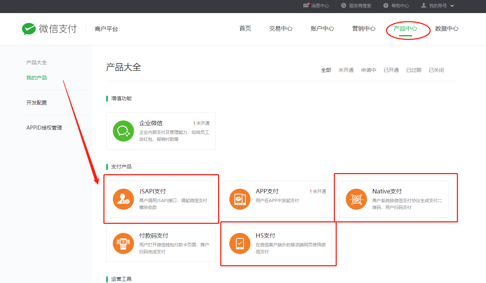


譬如点击`JSAPI支付`, 点击产品设置

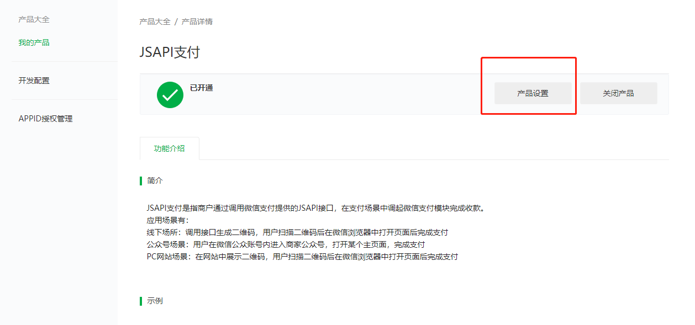

添加支付授权目录：


3.H5支付配置

商户支付平台-->产品中心-->开发配置，添加`H5支付域名`

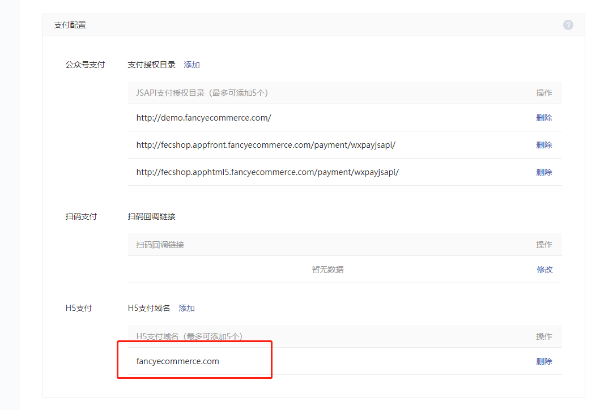

需要注意：

1.对于vue端，支付的目录为`http://demo.fancyecommerce.com/#/payment/wxpayjsapi/` 
,但是，需要填写域名，并以`/`结尾，不可以填写`#`后面的内容，
否则会出问题


2.对于h5这种不是SPA 页面类型的入口（不是vue等），譬如html5，需要填写完整目录，
譬如：http://fecshop.apphtml5.fancyecommerce.com/payment/wxpayjsapi/

3.您可以将上面的域名替换成您自己的域名作为格式
，这里一定要设置好，否则无法使用支付。


到这里，基本就设置好了微信支付


### Fecshop配置微信支付

1.参数配置

因为微信库包sdk的配置是const常量，因此比较纠结，最后
把配置文件放到了 `@common/config/payment/wxpay/lib/WxPay.Config.php`文件中
,更改里面的配置即可。


```
const APPID = 'wxb508f3849c440445';
const MCHID = '1537420921';
const KEY = '8934e7d15453e97507ef794cf7b0519e';
const APPSECRET = 'fd896d9750faf1efb58194eec4789761';
```

1.1APPID和MCHID（商户号）：


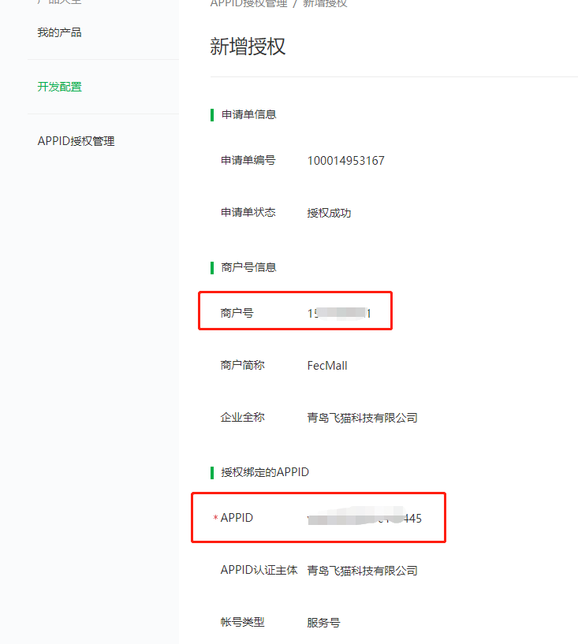


1.2KEY:  打开网址：https://pay.weixin.qq.com/core/cert/api_cert

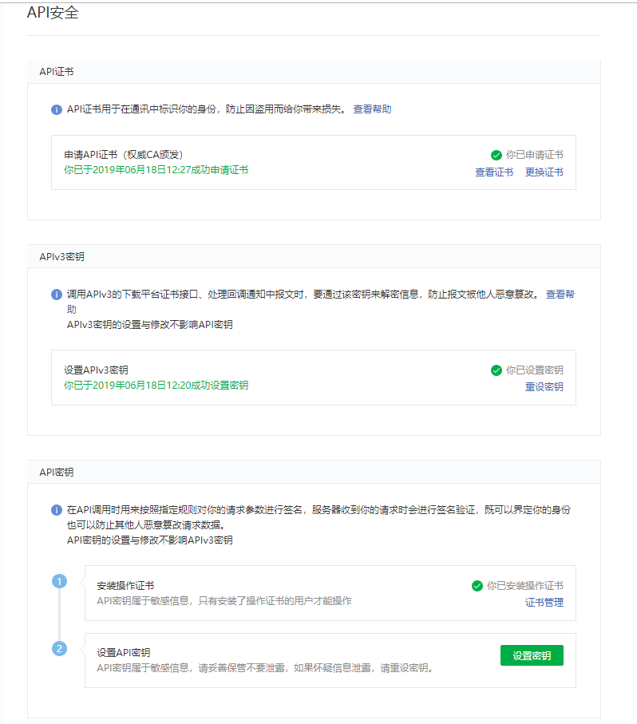

您可以将fecmall默认的KEY，修改一下参数（KEY的位数不要变），然后进行设置保存即可，您可以将API密钥，apiv3密钥都用一样
的，方便开发设置


1.3APPSECRET

登陆您的服务号，

开发-->基本配置

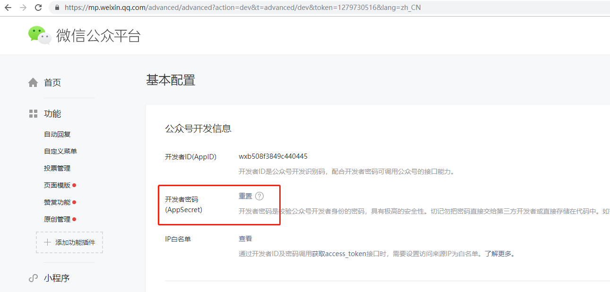

这里设置APPSECRET


您需要配置这4个变量

2.上传证书

登陆商户支付平台，打开网址：https://pay.weixin.qq.com/core/cert/api_cert

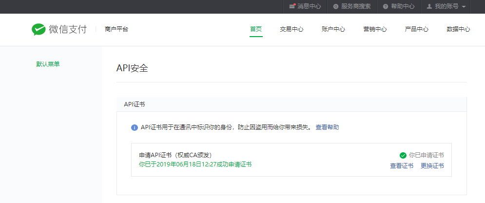

安装证书，然后下载下来，

打开`@common/config/payment/wxpay/cert/`文件夹可以看到两个证书文件，
`apiclient_cert.pem` 和 `apiclient_key.pem`, 您需要将下载微信的证书，进行覆盖即可


通过上面的设置，基本就设置完成了，如果您还存在问题，您可以来：http://www.fecshop.com/topic 发帖咨询。

您可以在您的微信商城中进行微信支付的测试了。


