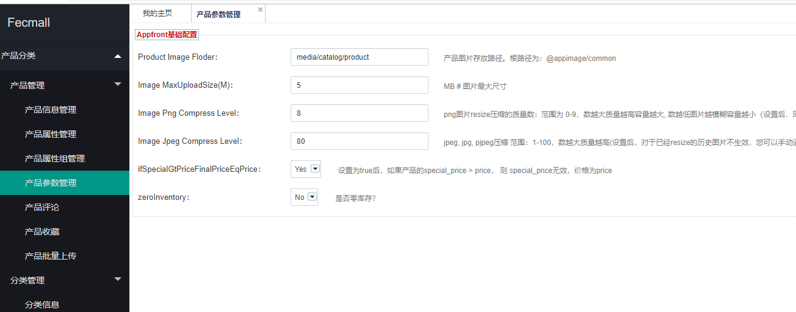
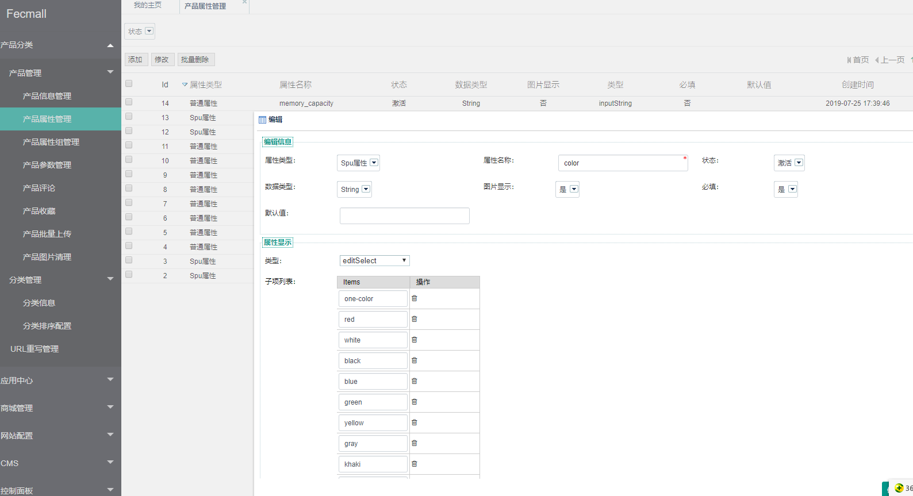
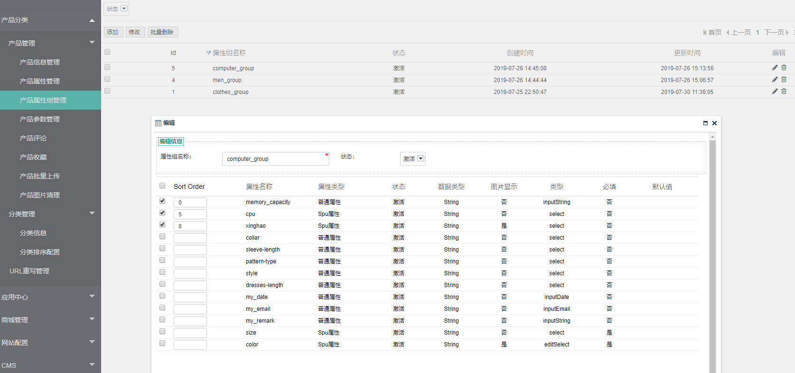
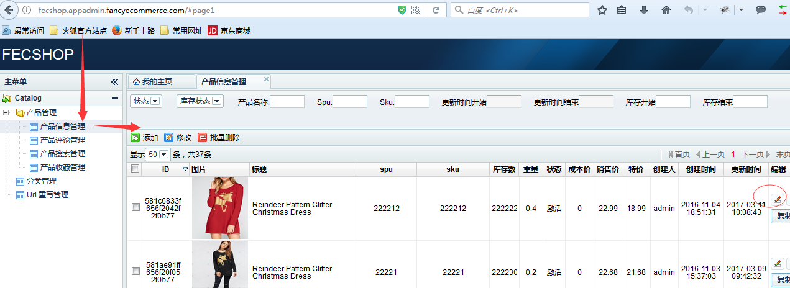
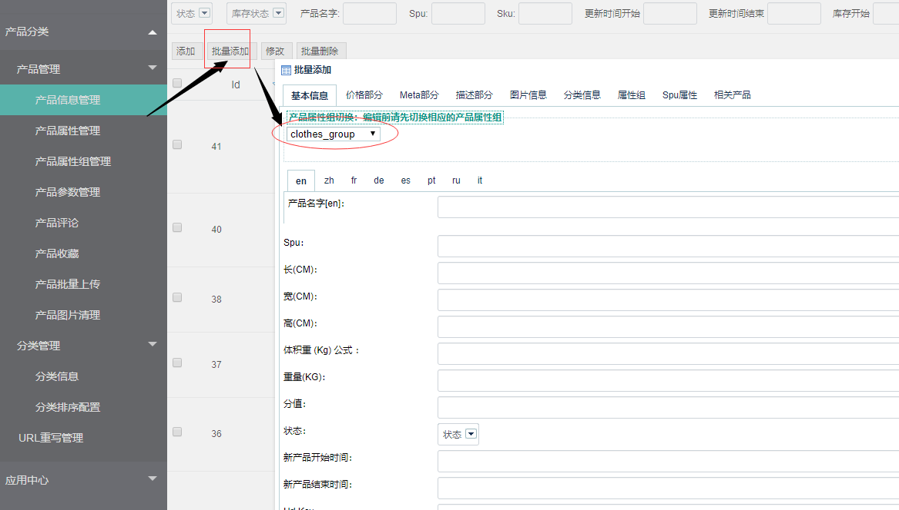
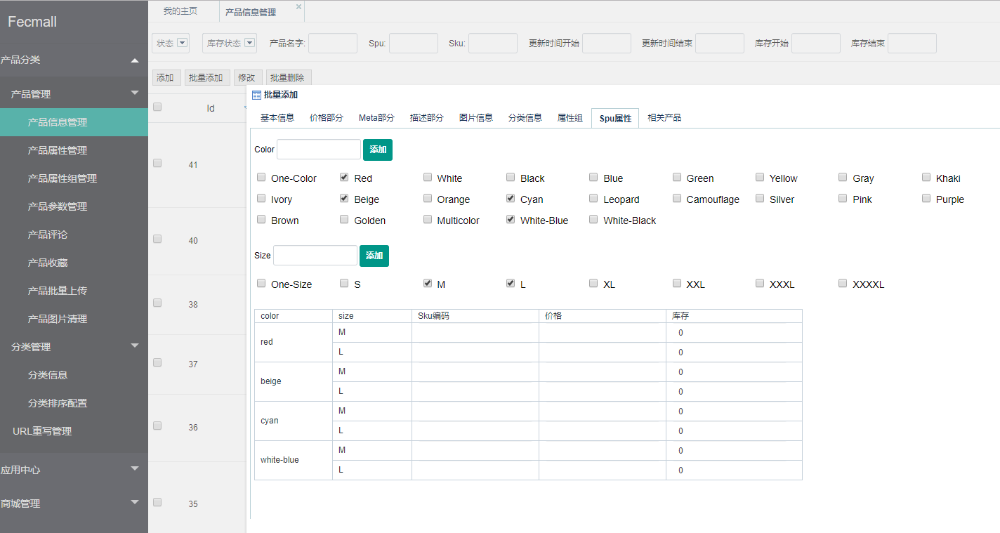
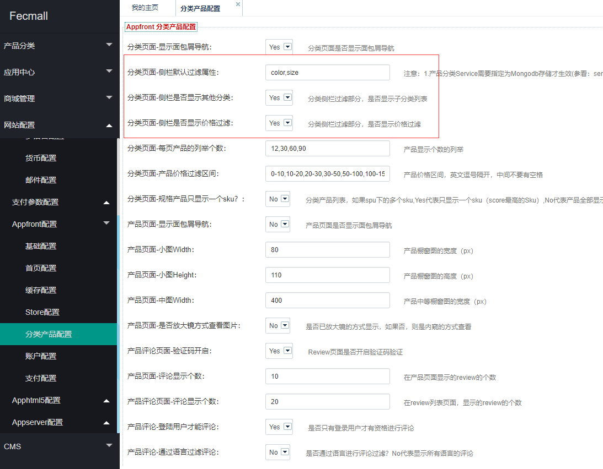
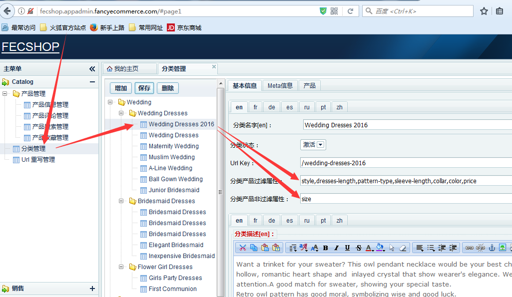
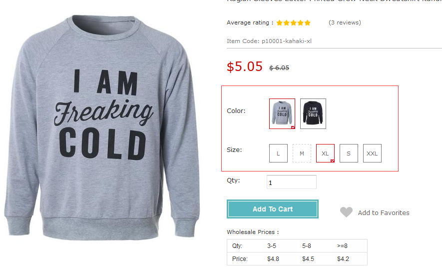
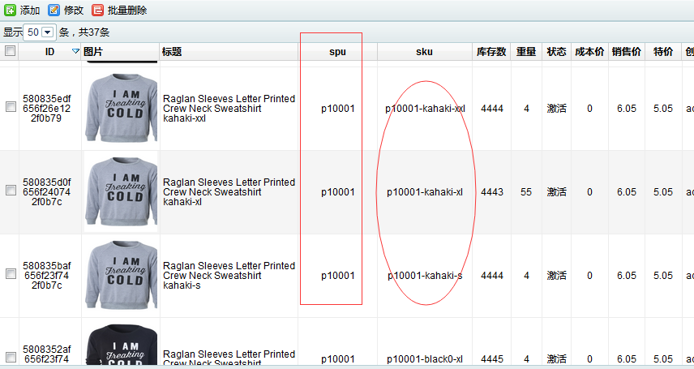

Fecmall 产品
============

> 作为电商系统，很多地方都是围绕产品展开的，譬如产品分类，产品搜索，产品评论，
> 产品收藏，购物车产品，订单产品等等。


Fecmall后台设置产品参数





### 产品属性：



您可以添加产品属性，产品属性分为`普通属性`和`spu属性`,

`普通属性`：产品的属性字段，用来显示记录

`spu属性`：规格属性，譬如颜色尺码等，加入购物车的时候，需要进行选择颜色尺码

### 产品属性组：



可以为属性组，选择属性，选择后，该属性组的产品，将拥有这些属性


### 后台产品编辑



### 批量添加规格产品





### 分类页面产品属性过滤的设置

就是前端页面侧栏的产品过滤，如图：


如何设置呢？




2、个性化设置

在上面设置的全局设置的基础上，可以进行个性化设置，后台打开分类，如图：



**分类产品过滤属性：**是在全局设置的基础上添加一些新的产品属性，用于分类侧栏属性过滤

**分类产品非过滤属性：**是在全局设置的基础上删除一些产品属性，譬如下面的图中，
添加的是size，虽然在全局设置中添加了size，但是该分类添加了size，因此该
分类侧栏的属性过滤不会有size。

通过上面，我们可以很方便的添加产品在分类侧栏的属性过滤。


### 搜索页面产品属性过滤的设置

1.首先设置搜索语言，`@common/config/fecshop_local_services/Search.php`

1.1

```
return [
	'search' => [
		'filterAttr' => [
			'color','size', # 在搜索页面侧栏的搜索过滤属性字段
		],
		'childService' => [
			'mongoSearch' => [
				'searchIndexConfig'  => [ #设置用于全文搜索的产品属性以及权重，权重高的属性，排名靠前。
					'name' => 10,  	# 产品name作为full search text的属性，权重为10
					'description' => 5,   # 产品description作为full search text的属性，权重为5
				],  
				# more: https://docs.mongodb.com/manual/reference/text-search-languages/#text-search-languages
				'searchLang'  => [
					'en' => 'english',
					'fr' => 'french',
					'de' => 'german',
					'es' => 'spanish',
					'ru' => 'russian',
					'pt' => 'portuguese',
				],
			],
			'xunSearch'  => [
				'fuzzy' => true,  # 是否开启模糊查询
				'synonyms' => true, #是否开启同义词翻译
				'searchLang'    => ['zh'],
			],
		],
	]
];
```
1.1
`filterAttr`是添加在搜索页面侧栏用于过滤的产品属性。

1.2
`searchIndexConfig`是设置用于全文搜索的产品属性以及权重，权重高的属性，排名靠前。

1.3
`searchLang`是设置搜索的语言，全文搜索是需要根据语言切词的，
因此各个语言的搜索会略有差异，根据各个语言，生成对应的产品语言搜索表。

2.生成搜索表

首先需要根据上面的配置文件，设置您的所有的语言。也就是上面的`searchLang`。

每一个语言对应一个产品搜索表，这是因为mongodb的full text search，一个表只能有一个
语言选项，因此需要生成多个产品搜索表，生成的脚本为：

`@fecshop/shell/search/fullSearchSync.sh`，您进入@fecshop/shell/search下
执行`sh fullSearchSync.sh`即可。

### 设置产品的自定义属性

产品的自定义属性如图：



#### 1.产品的规格属性，目前只有jd模式，淘宝模式已经去除

JD模式：类似于京东的产品，选择每一个选项后，页面会跳转到另外一个url页面，
也就是说：每一个选项就是一个产品（在数据库产品表中是一行数据）。

#### 2.下面详细说明：

2.1京东模式：这种模式，需要引入sku和spu的概念，关于这个概念在上面已经说明。
譬如页面（演示demo）：http://fecshop.appfront.fancyecommerce.com/index.php/raglan-sleeves-letter-printed-crew-neck-sweatshirt-53386451-77774122

2.1.1配置：首先需要设置一个属性组，上面的内容已经说明，在配置文件中添加，
需要注意的spu属性不能超过两个（spu属性组合的复杂性）。

2.1.2新建产品，选择对应的属性组,如图


就可以查看到这个属性组中的属性，填写值即可。

填写sku和spu，需要注意的是，您新建的该款产品的spu必须相同，sku不同，一般用您的
spu+spu属性的值组合成sku，如图，我新建的spu对应的几个sku产品。



2.1.3 按照上面如图的方式配置完成后，基本就完成了配置，在前台就可以看到了。

### 产品价格


`成本价格`：代表产品的成本，也就是采购在fecmall中，只是记录一下，没有其他用处，
当然，您可以通过脚本，生成您的出售价格。

`销售价格`：也就是产品在页面显示的价格

`销售特价`：产品的特价，当设置了产品的特价，而且特价时间没有过期，则特价是有效的，
当销售特价有效时，销售价格就会失效。

`特价开始时间`：产品销售特价开始的时间

`特检结束时间`：产品销售特价结束的时间

`Tier Price`： 批发价格

规定产品购买几个以上的价格。譬如购物2个以上17美元，购买4个以上16美元。

对于在产品分类页面显示的产品的几个都是一个产品的价格。产品中有一个最终价格，
是通过脚本计算出来的，这个最终价格用于在分类页面的价格排序以及价格过滤，该脚本一天跑一次。
文件为： @fecshop/shell/computeProductFinalPrice.sh，
可以在cron中配置该脚本一天跑一次。

### 产品导入和导出

目前后台还没有做这个功能。


