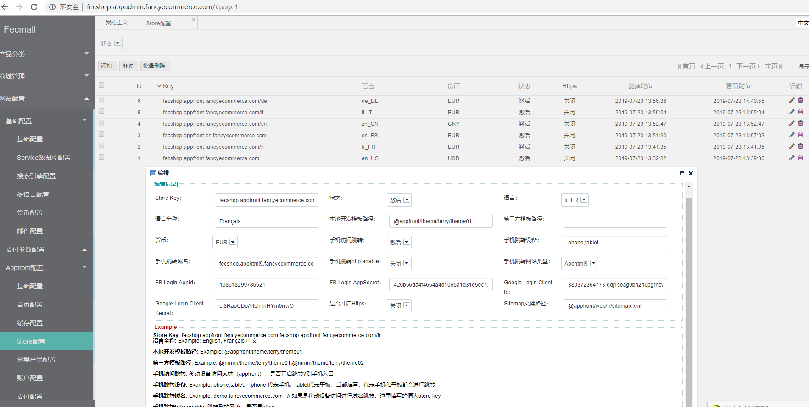

Fecmall Store
=============

> fecmall是支持多store的，store一般是用来构建多语言站点，
> 可以为每一个store指定不同的语言和url结构，设置不同的语言，默认货币,模板等。


### Fecmall 后台配置

1.fecmall的store针对的是多语言，您可以多种方式设置您的多语言访问路径

1.1子域名方式,譬如：

`fr.domain.com`,  `it.domain.com`,  `es.domain.com`,  `ru.domain.com`

1.2后缀方式，譬如：

`www.domain.com/fr`,
`www.domain.com/it`,
`www.domain.com/es`,
`www.domain.com/ru`

2.域名解析以及nginx配置好后，您需要在后台添加store，如图：



`Store Key`：您的store的根访问，譬如：`fr.domain.com`,`www.domain.com/fr`
，您按照该格式填写即可

`状态`： store是否激活。

`语言`：store对应的语言

`语言全称`：语言的全称，将显示在前端商城切换语言处

`本地开发模板路径`：默认即可，如果您想要更改，改成你的本地模板路径即可

`第三方模板路径`：如果您安装了第三方模板，可以在这里填写第三方模板文件路径，
如果是多个，用英文逗号`,`隔开即可。

`货币`：当前store的默认货币


`手机访问跳转`：代表手机web访问pc页面，是否进行跳转

`手机跳转设备`：哪些移动设备访问，进行跳转，phone代表手机，tablet代表平板

`手机跳转域名`：代表手机web访问pc页面，跳转后的域名

`手机跳转http enable`：代表跳转的手机端，是否https？

`手机跳转类型`：跳转的域名对应的入口，是apphtml5，还是vue类型

`FB Login AppId`： Facebook登陆的AppId

`FB Login AppSecret`： Facebook 登陆的AppSecret

`Google Login Client` ： Google登陆的Client

`Google Login Client Secret`：Google登陆的Secret

`是否开启Https`：当前store是否使用https的访问方式

`Sitemap文件路径`：当前store的sitemap的文件访问路径


### store原理

4.1 在入口文件 `@app/web/index.php` ，可以加载所有的配置文件，合并

4.2 对于`appfront`  `appserver`  `apphtml5`这三个入口是需要`store`的，
因此需要在Yii2 bootstrap初始化过程中就开始执行，下面以appfront入口为例子讲解

`@fecshop/app/appfront/config/appfront.php` ， 可以看到配置：

```
'bootstrap' => ['store'],

```

也就是在初始化的时候执行store component，关于Yii2的bootstrap可以查看资料：
[启动引导（Bootstrapping）](http://www.yiichina.com/doc/guide/2.0/runtime-bootstrapping)
,
[yii2 初始化的bootstrap过程 -引导](http://www.fancyecommerce.com/2016/05/18/yii2-%E5%88%9D%E5%A7%8B%E5%8C%96%E7%9A%84bootstrap%E8%BF%87%E7%A8%8B-%E5%BC%95%E5%AF%BC/)

下面我们去找`store component`

4.3 打开配置文件： `@fecshop/config/components/Store.php` 文件可以看到：

```
return [
    'store' => [
        'class' => 'fecshop\components\Store',
    ],
];
```

通过配置文件，我们找到`store component` , `@fecshop\components\Store.php`,
代码如下：

```
class Store extends Component implements BootstrapInterface
{
    public function bootstrap($app)
    {
        Yii::$service->store->bootstrap($app);
    }
}
```

通过上面的代码，我们可以看到，就是执行store services 的`bootstrap`方法
，通过配置文件：`@fecshop/config/services/Store.php`，我们可以看到

```
'store' => [
        'class' => 'fecshop\services\Store',
```

我们打开 `@fecshop\services\Store.php` ,查看 `bootstrap()`方法，
可以看到很多`store`的初始化代码，譬如语言，货币等，
都是在这个函数里面进行的，您可以细看里面的代码，具体您可以查看这个文件，这里不做代码粘贴了。


