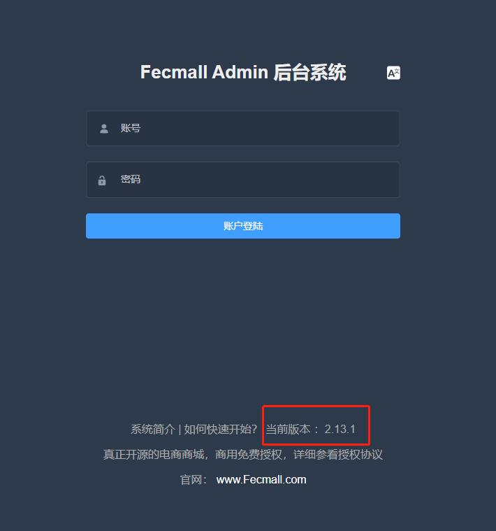

Fecmall 如何查看版本号
=========

> 如何查看Fecmall的版本号？


### Fecmall版本号


1.新版本查看版本号方式


可以在fecmall  admin后台登陆页面底部查看版本号




注意，后台查看版本号，是在`Fecmall-2.8.4`版本以后才有的，详细参看：https://www.fecmall.com/topic/4605

2.老版本查看版本号

如果您在admin后台看不到版本号，那么说明您的版本有点老，应该是
`Fecmall-2.8.4`之前的版本，您需要通过`composer.json`查看


打开网站根目录的`composer.json`文件，找到

```
"fancyecommerce/fecshop": "2.8.1"
```


后面的`2.8.1`就是您当前的版本号。

3.后台查看版本号的原理：

根目录的`composer.json`文件，这个是最准的版本号，也就是在github发版的版本号，composer通过该版本号进行加载相应的包

通过`composer.json`查看具体的版本号，对于新版本和老版本都是可以的。

而对于第1部分的通过后台查看版本号，实际是通过函数读取的预设值，也就是:https://github.com/fecshop/yii2_fecshop/blob/master/services/Helper.php#L43


