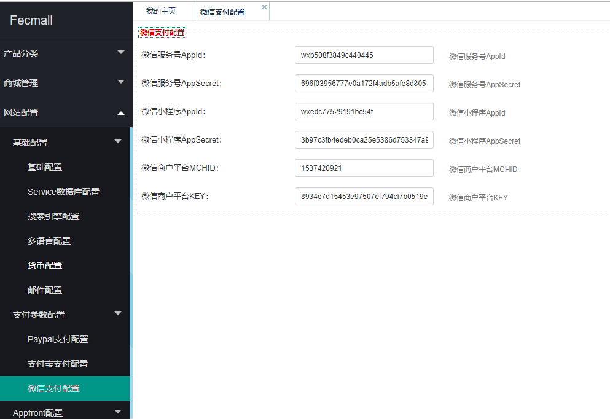
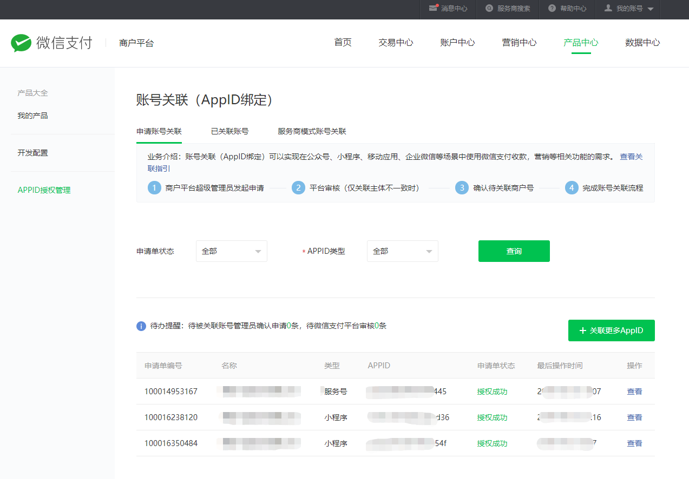
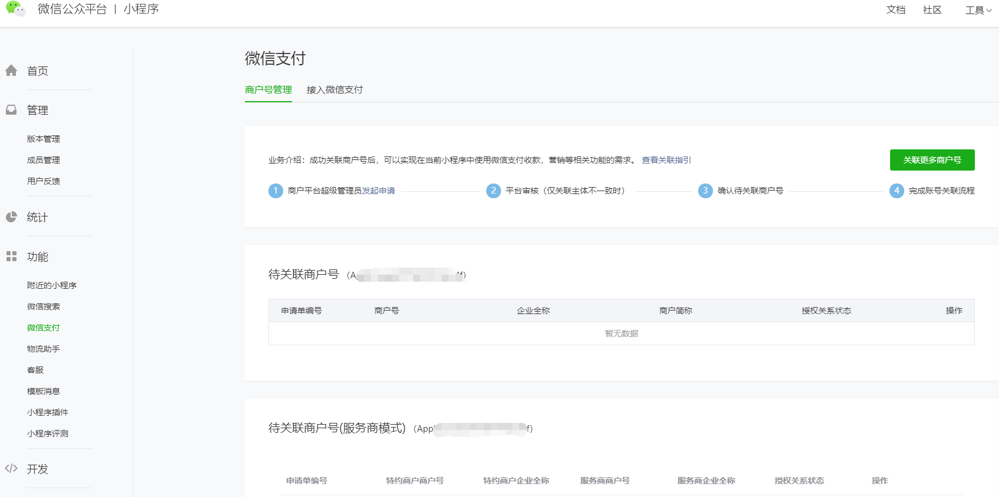

Fecmall 微信小程序
==============

> Fecmall小程序端的使用

### fecmall后台配置

在使用小程序的时候，需要设置 `微信小程序AppId`  和 `微信小程序AppSecret`
，以及微信商户平台`MCHID` 和 `KEY`

### 微信小程序设置

1.小程序设置域名，以及获取`AppID` 和 `AppSecret(小程序密钥)	`

1.1获取`AppID` 和 `AppSecret(小程序密钥)	`，填写到后台。

1.2这个域名对应的是fecmall的appserver端的域名，线上需要https才行，开发环境可以用http（微信开发工具可以设置）

关于如何配置https，可以参看：http://www.fecmall.com/topic/4085

2.小程序和微信商户平台进行关联

微信商户支付后台，进行关联：

微信小程序确认关联：

3.您需要开通微信服务号，并开通微信支付，登陆微信商户平台设置收款信息，这个您可以
参看：[Fecmall 微信支付](fecshop_payment_wx_method.md)

